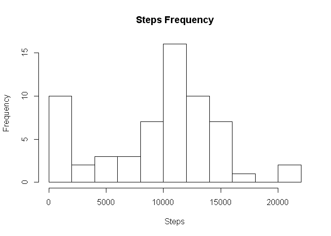
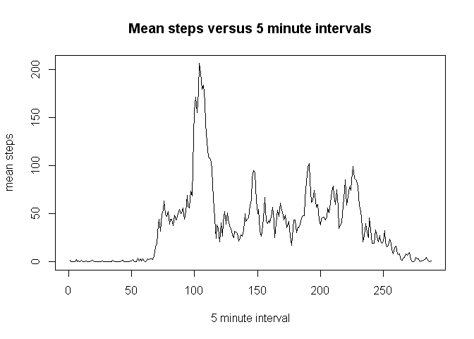
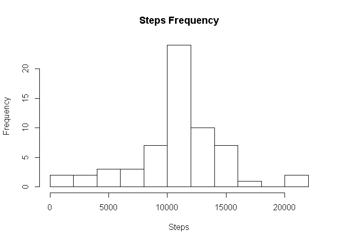
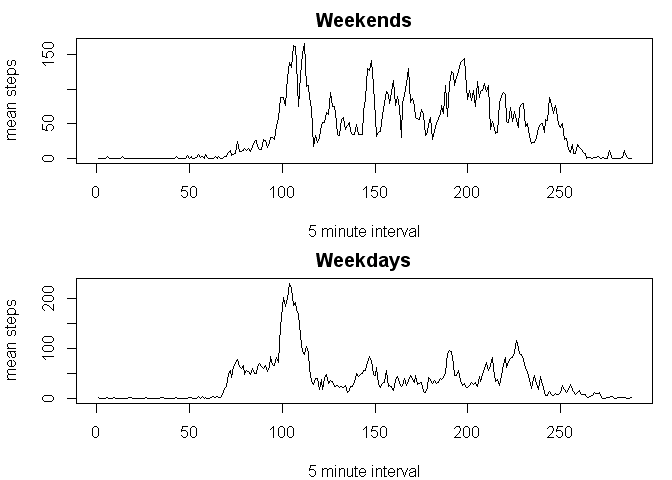

# Reproducible Research: Peer Assessment 1

In this project I am going to investigate data produced by a personal activity monitor worn an for anonymous individual in October and November of 2012.  The data breaks each day into 5 minute intervals (so that each day has 288 intervals) and records the number of steps detected by the monitor in each of those intervals.<br><br>

## Loading and preprocessing the data
We begin by loading the data into R:


```r
stepData<-read.csv(unz("activity.zip",filename="activity.csv"))
```

Here is a quick look at the first few rows of the data


```r
head(stepData)
```

```
##   steps       date interval
## 1    NA 2012-10-01        0
## 2    NA 2012-10-01        5
## 3    NA 2012-10-01       10
## 4    NA 2012-10-01       15
## 5    NA 2012-10-01       20
## 6    NA 2012-10-01       25
```

No other preprocessing is required for this data set.<br><br>

## What is mean total number of steps taken per day?

In order to prepare a histogram of the number of steps taken each day, I have assembled a vector named steps that adds up the number of steps taken in all of the 5 minute intervals for each day.  The argument na.rm=TRUE tells R to ignore any missing values.


```r
steps<-tapply(stepData$steps,stepData$date,sum,na.rm=TRUE)
```

<br>

####The histogram


```r
hist(steps,main="Steps Frequency",xlab="Steps",breaks=10)
```

 

####Computing the mean and median

From the histogram, we might expect the mean and median to be around 10,000.  The following commands compute the exact values.


```r
mean(steps)
```

```
## [1] 9354.23
```

```r
median(steps)
```

```
## [1] 10395
```

The mean is approximately 9354 and the median is approximately 10395.<br><br>

## What is the average daily activity pattern?

The investigation now turns to how the number of steps taken varies throughout a day.  I'll begin by making a new data frame, meanSteps, containing the mean steps for each of the 5 minute intervals in a day as well as the name for that interval from the steps data frame.


```r
meanSteps=data.frame(
  mean=tapply(stepData$steps,stepData$interval,mean,na.rm=TRUE),
  interval=tapply(stepData$interval,stepData$interval,function(x)x[1],simplify=TRUE)
  )
```

<br>

####A time series plot of the step data
Using the meanSteps data frame, we can construct a time series plot showing the average number of steps taken in each 5 minute interval of the day.


```r
plot(meanSteps$mean,type = "l",
     ylab="mean steps",
     xlab="5 minute interval",
     main="Mean steps versus 5 minute intervals"
     )
```

 

####The maximum number of steps

From the plot it looks like the maximum steps were taken somewhere around the 110th interval.  We can get the exact interval with the following command.


```r
as.numeric(which(meanSteps$mean==max(meanSteps$mean)))
```

```
## [1] 104
```

So the maximum steps were takin in the 104th interval (a little after 8:30AM).<br><br>

## Imputing missing values

The data set contains some missing values in the steps column.<br><br>  

####How many missing values are there?


```r
sum(is.na(stepData$steps))
```

```
## [1] 2304
```

```r
sum(is.na(stepData$steps))/length(stepData$steps)
```

```
## [1] 0.1311475
```

There are 2304 missing values which is about 13% of the total data points. <br><br>

####A strategy for filling in the missing values

To fill in the missing values, I'll first copy the stepData frame to a new data frame named imputedStepData and then loop over the new data frame filling in any missing values for a 5 minute interval with the average for that five minute interval from the meanSteps data frame.<br><br> 

####Filling in the missing data


```r
imputedStepData<-stepData

for(i in 1:length(imputedStepData$steps))
{
  if(is.na(imputedStepData$steps[i]))
  {
    j<-imputedStepData$interval[i]
    interval<-which(meanSteps$interval==j)
    mean<-meanSteps[interval,1]
    imputedStepData$steps[i]<-mean
  }
}
```

As a quick check, I'll look at the first few rows of the step data from the original table, the imputed table, and the table of mean steps.


```r
head(data.frame(
  steps=stepData$steps,
  imputedsteps=imputedStepData$steps,
  meansteps=rep(meanSteps$mean,61)
  ))
```

```
##   steps imputedsteps meansteps
## 1    NA    1.7169811 1.7169811
## 2    NA    0.3396226 0.3396226
## 3    NA    0.1320755 0.1320755
## 4    NA    0.1509434 0.1509434
## 5    NA    0.0754717 0.0754717
## 6    NA    2.0943396 2.0943396
```

<br>

####Looking at the imputed data set

Now I want to look at a histogram to see how the numbers of steps breaks down in the new data set.  As I did above, I'll begin my constructing a vector of total number of steps taken in each day.


```r
imputedSteps<-tapply(imputedStepData$steps,imputedStepData$date,sum)
```

The histogram is shown below. 


```r
hist(imputedSteps,main="Steps Frequency",xlab="Steps",breaks=10)
```

 

Compared to the earlier histogram, this one shows significantly fewer days with zero steps.  

Finally, I'll compute the mean and median for the number of steps with the new data set.


```r
mean(imputedSteps)
```

```
## [1] 10766.19
```

```r
median(imputedSteps)
```

```
## [1] 10766.19
```

From the new set of data, we can conclude

- The mean for the imputed data is approximately 10766.  That is higher than the value of 9354 in the first set.  
- The median is also approximately 10766.  As with the mean, this is also higher than the value of 10395 from the first set.
- OVerall, imputing the missing values seems to reduce the skewness in the data.<br><br>

## Are there differences in activity patterns between weekdays and weekends?

For the final part of this data analysis, I'll break the data into data for weekdays and weekends and compare the average number of steps taken in each 5 minute interval for both kinds of days.<br><br>

####A new factor variable
To begin, I'll add a new column to the imputedStepData data frame indicating if the day is a weekday or a weekend day. 


```r
imputedStepData$daytype<-sapply(imputedStepData$date,
    function(x){
        if(weekdays(as.Date(as.character(x))) %in% c("Saturday","Sunday")) 
          "weekend"
        else 
          "weekday" 
    }                      
)

imputedStepData <- transform(imputedStepData, daytype = factor(daytype))
```

<br>

####Comparing weekdays and weekend days

Next I'll subset the data into 2 new frames: a frame for weekdays and another frame for weekends.


```r
weekdays<-subset(imputedStepData,daytype=="weekday")
weekends<-subset(imputedStepData,daytype=="weekend")
```

Finally, I'll assemble a panel plot showing the steps versus 5 minute interval for both weekend days and weekdays.


```r
par(mfrow=c(2,1),mar=c(4,4,2,1))

plot(tapply(weekends$steps,weekends$interval,mean),
       type = "l",
       ylab="mean steps",
       xlab="5 minute interval",
       main="Weekends"
     )

plot(tapply(weekdays$steps,weekdays$interval,mean),
       type = "l",
       ylab="mean steps",
       xlab="5 minute interval",
       main="Weekdays"
     )
```

 

It appears that on weekdays, the number of steps is largest in the morning and falls off for the rest of the day.  On the weekends, the number of steps is also largest in the morning but is more consistent throughout the rest of the day (at least for waking hours).
