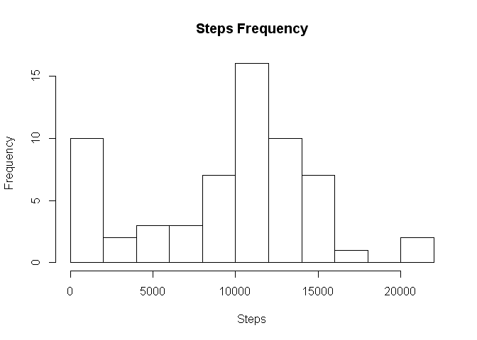
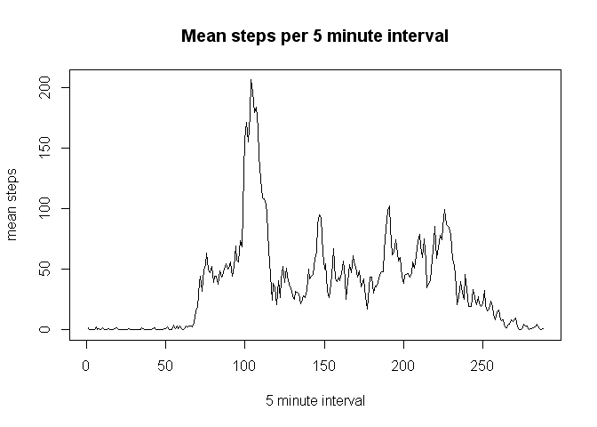
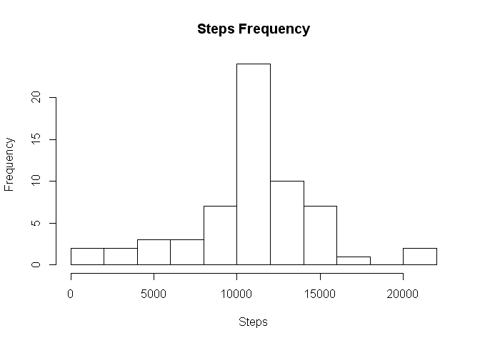
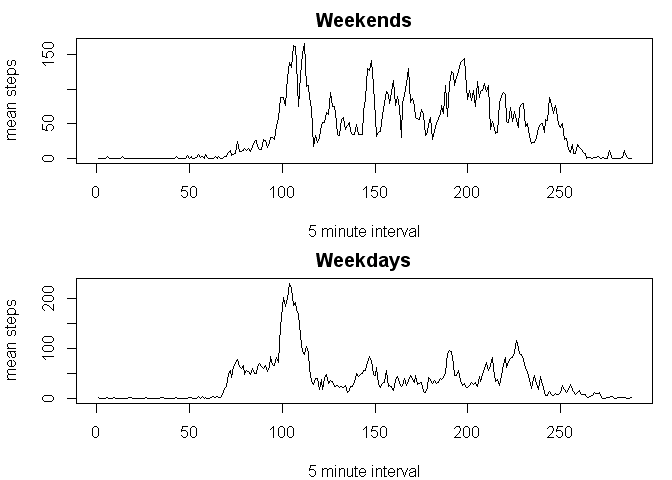

# Reproducible Research: Peer Assessment 1

In this project we're going to investigate
data collected with an activity monitor for an
anonymous individual collected in October and November of 2012.  We begin by loading the data.


## Loading and preprocessing the data

```r
stepData<-read.csv(unz("activity.zip",filename="activity.csv"))
```


## What is mean total number of steps taken per day?

Lets look at a histogram of the steps broken
down by day.  Here we use the na.rm=TRUE argument to ignore any missing data.


```r
hist(tapply(stepData$steps,stepData$date,sum,na.rm=TRUE),main="Steps Frequency",xlab="Steps",breaks=10)
```

 

From the histogram, we might expect the mean and median to be around 10,000.

Here we compute the actual values for the mean and median:


```r
mean(tapply(stepData$steps,stepData$date,sum,na.rm=TRUE))
```

```
## [1] 9354.23
```

```r
median(tapply(stepData$steps,stepData$date,sum,na.rm=TRUE))
```

```
## [1] 10395
```


## What is the average daily activity pattern?
Now lets look at the daily avtivity pattern.
Lets begin by making a new vector, meanSteps, containing the mean steps for each of the 5 minute intervals in a day.


```r
meanSteps<-tapply(stepData$steps,stepData$interval,mean,na.rm=TRUE)

meanSteps=data.frame(mean=tapply(stepData$steps,stepData$interval,mean,na.rm=TRUE),interval=tapply(stepData$interval,stepData$interval,function(x)x[1],simplify=TRUE))
```


Here is a time series of meanSteps:


```r
plot(meanSteps$mean,type = "l",ylab="mean steps",xlab="5 minute interval",main="Mean steps per 5 minute interval")
```

 

From the plot it looks like the maximum steps
were taken somewhere around the 110th interval.  We can get the exact interval with the following command.


```r
as.numeric(which(meanSteps$mean==max(meanSteps$mean)))
```

```
## [1] 104
```

So the maximum steps were takin in the 104th interval (a little after 8:30AM).


## Imputing missing values

    Calculate and report the total number of missing values in the dataset (i.e. the total number of rows with NAs)


```r
sum(is.na(stepData$steps))
```

```
## [1] 2304
```


```r
sum(is.na(stepData$steps))/length(stepData$steps)
```

```
## [1] 0.1311475
```


    Devise a strategy for filling in all of the missing values in the dataset. The strategy does not need to be sophisticated. For example, you could use the mean/median for that day, or the mean for that 5-minute interval, etc.


    Create a new dataset that is equal to the original dataset but with the missing data filled in.


```r
imputedStepData<-stepData

for(i in 1:length(imputedStepData$steps))
{
  if(is.na(imputedStepData$steps[i]))
  {
    j<-imputedStepData$interval[i]
    interval<-which(meanSteps$interval==j)
    mean<-meanSteps[interval,1]
    imputedStepData$steps[i]<-mean
  }
}
```

    Make a histogram of the total number of steps taken each day and Calculate and report the mean and median total number of steps taken per day. Do these values differ from the estimates from the first part of the assignment? What is the impact of imputing missing data on the estimates of the total daily number of steps?


```r
imputedSteps<-tapply(imputedStepData$steps,imputedStepData$date,sum,na.rm=TRUE)

hist(imputedSteps,main="Steps Frequency",xlab="Steps",breaks=10)
```

 

```r
mean(imputedSteps)
```

```
## [1] 10766.19
```

```r
median(imputedSteps)
```

```
## [1] 10766.19
```


## Are there differences in activity patterns between weekdays and weekends?


```r
imputedStepData$daytype<-sapply(imputedStepData$date,
            function(x){
              if(!(weekdays(as.Date(as.character(x))) %in% c("Saturday","Sunday"))) 
                "weekday" 
              else 
                "weekend"
            }                      
)

imputedStepData <- transform(imputedStepData, daytype = factor(daytype))
```


```r
weekdays<-subset(imputedStepData,daytype=="weekday")

weekends<-subset(imputedStepData,daytype=="weekend")

par(mfrow=c(2,1),mar=c(4,4,2,1))

plot(tapply(weekends$steps,weekends$interval,mean,na.rm=TRUE),type = "l",ylab="mean steps",xlab="5 minute interval",main="Weekends")

plot(tapply(weekdays$steps,weekdays$interval,mean,na.rm=TRUE),type = "l",ylab="mean steps",xlab="5 minute interval",main="Weekdays")
```

 


